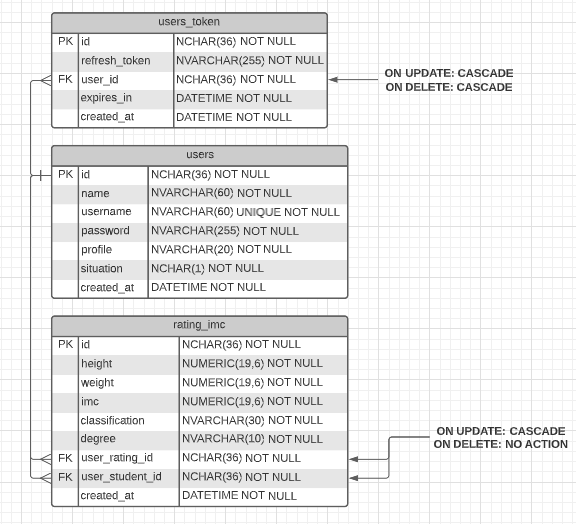

# Hackathon

Desafio proposto para finalização da Pós-Graduação da UniALFA Umuarama de Desenvolvimento de Aplicações para Internet e Dispositivos Móveis.

## Sobre o desafio

Uma academia precisa de um programa para acompanhamento da evolução dos seus
alunos quanto ao índice IMC. Portanto, resolveu-se contratar uma empresa para desenvolver
uma aplicação onde o cliente ou aluno possa ser cadastrado, assim como o profissional ou
professor que irá realizar as avaliações. Essas avaliações devem ser armazenadas, para saber
se o aluno teve evolução ou não no IMC. O programa poderá gerar relatórios por aluno das
últimas avaliações, se possível com gráficos. O sistema deve ser seguro, e acessado pelos
professores, usuários administradores ou alunos.

## Requisitos levantados com base no desafio proposto

### Requisito funcional
- Deve ter um cadastro de usuário com perfil administrador, aluno ou professor
- Deve ter um cadastro de avaliações do IMC do aluno
- Deve ter relatório por aluno de suas avaliações com gráfico
- Deve ter autenticação com usuário e senha e pode ser acessado pelos administradores, professores ou alunos

### Requisito de negócio
- Usuário com perfil administrador pode cadastrar usuário com perfil administrador, professor ou aluno, cadastrar avaliação de IMC e consultar avaliação de alunos
- Usuário com perfil professor pode cadastrar usuários com perfil aluno, cadastrar avaliação de IMC e consultar avaliação de alunos
- Usuário com perfil aluno só pode consultar as suas avaliações de IMC

### DER

  

## Tecnologias e ferramentas utilizadas

### Frontend
- Typescript
- React js com Next js
- Chakra UI
- React Hook Form com Yup
- React Query
- Axios

### Backend
- Typescript
- Node js + Express com TypeORM
- Validação da entrada de dados nos endpoints com Celebrate
- MySQL como banco de dados

### URL da documentação
- https://documenter.getpostman.com/view/5013246/2s8YzZNy68